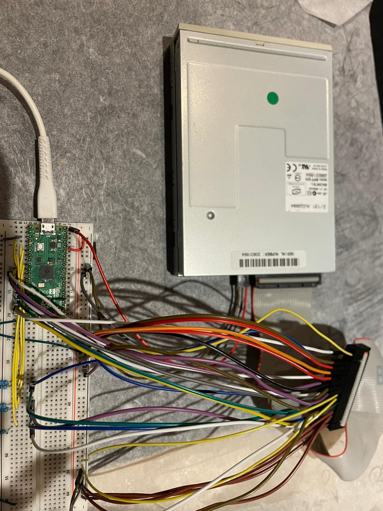

# Pico Floppy

A bare-metal 3.5" HD floppy disk driver for the Raspberry Pi Pico 2 (RP2350). MFM encoding/decoding and FAT12 filesystem with no dedicated floppy controller hardware — just PIO and software.

Verified against 9 real floppy disks (System Shock, 1994) decoded from raw magnetic flux captures.



## Architecture

```
Application
    │
    ▼
f12 API ──── open / read / write / seek / delete / readdir
    │
    ▼
LRU Cache ── 54 sectors (3 tracks)
    │
    ▼
FAT12 ────── BPB, FAT tables, directories, cluster chains, batched writes
    │
    ▼
floppy ───── motor, seek, side select, sector read, track write
    │
    ▼
MFM ──────── flux pulse intervals ↔ data bytes (adaptive timing, write precomp)
    │
    ▼
PIO ──────── flux_read (24 MHz pulse measurement) / flux_write (pulse generation)
    │
    ▼
Drive ────── magnetic flux transitions on spinning disk
```

## Source

```
src/
├── flux_read.pio       PIO: measure time between flux transitions
├── flux_write.pio      PIO: generate flux transitions with precise timing
├── mfm_decode.c/h      4-state MFM decoder with adaptive timing calibration
├── mfm_encode.c/h      MFM encoder with write precompensation
├── crc.c/h             CRC-16/CCITT (table lookup)
├── floppy.c/h          Drive control: motor, seek, side, sector read, track write
├── fat12.c/h           FAT12 filesystem with batched sector writes
├── f12.c/h             High-level file API with LRU sector cache
└── lru.c/h             Generic LRU cache (doubly-linked list over flat storage)
```

## Hardware

3.5" HD floppy drive connected to the Pico via 34-pin interface. All signals are active-low open-drain.

```
Floppy Pin   Signal           Pico GPIO
────────────────────────────────────────
 8           /INDEX           GP2
26           /TRACK_0         GP3
28           /WRITE_PROTECT   GP4
30           /READ_DATA       GP5  ← 4.7kΩ pull-up to 3.3V required
34           /DISK_CHANGE     GP6
12           /DRIVE_SELECT    GP7
10           /MOTOR_ENABLE    GP8
18           /DIRECTION       GP9
20           /STEP            GP10
22           /WRITE_DATA      GP11
24           /WRITE_GATE      GP12
32           /SIDE_SELECT     GP13
 2           /DENSITY         GP14

Odd pins (1-33): ground
Power: separate 5V supply (up to 1A), grounds connected
```

READ_DATA needs an external 4.7kΩ pull-up because the internal pull-ups (50kΩ) are too weak for 500 kHz MFM pulses.

## Building

Firmware (requires Pico SDK):
```sh
mkdir build && cd build
cmake .. && make
```

Tests (host-side, no hardware needed):
```sh
./tests/run_all.sh
```

## Key Features

**Adaptive MFM timing** — the decoder measures preamble pulse widths before each sector and calibrates classification thresholds dynamically. Handles ±8% drive speed variation (professional controllers required ±5%).

**Write precompensation** — on inner tracks (≥40), adjacent flux transitions are shifted ±125ns to counteract magnetic bit shift. Without this, inner track writes have 5-15% error rates.

**Batch-aware FAT writes** — the write batch system coalesces sector writes by track to minimize physical I/O. The free cluster search reads through the batch to see pending FAT updates, avoiding unnecessary flushes.

**Shared write batch** — a single 18KB write batch in `fat12_t` is shared across all writers, eliminating 166KB of wasted memory from per-file-handle batch storage.

## Testing

106 unit tests, 12,001 fuzz iterations, 100 SCP roundtrip fuzz iterations. Tested against real 1994 floppy disks.

```
tests/
├── test_lru.c            21 tests: cache operations, eviction, edge cases
├── test_mfm.c            15 tests: encode/decode roundtrip, all byte patterns
├── test_fat12.c          20 tests: filesystem operations, format, cluster chains
├── test_f12.c            15 tests: high-level API, directory listing, seek
├── test_robustness.c     13 tests: corrupt BPB, invalid pulses, truncated sectors
├── test_fuzz.c           12,001 iterations: random pulses, corrupt disks, FAT chaos
├── test_flux_sim.c        9 tests: synthetic flux + real SCP decode (all 9 disks)
├── test_scp_fat12.c       7 tests: mount SCP as FAT12, list files, read content
├── test_scp_roundtrip.c   8 tests: decode→modify→encode→decode→verify + fuzz
├── test_pio_sim.c         4 tests: real floppy.c code with PIO hardware simulation
├── test_pio_emu.c         3 tests: cycle-accurate PIO instruction emulation
├── flux_sim.c/h          SCP file parser + synthetic flux with jitter/drift
├── pio_sim.c/h           GPIO/PIO hardware simulator backed by SCP data
├── pio_emu.c/h           RP2040 PIO instruction set emulator (9 opcodes)
├── scp_disk.h            Flux-to-sector IO adapter (MFM decode on demand)
├── vdisk.h               In-memory sector-level virtual disk
└── test.h                Minimal test framework
```

### SCP Roundtrip Test

The strongest test: decode a real floppy from raw magnetic flux, modify files through FAT12, MFM-encode back to flux, write an SCP file, decode it again, and verify every file.

```
SCP flux capture (73MB Greaseweazle capture of 1994 System Shock floppy)
  → MFM decode (2880/2880 sectors, adaptive timing)
    → F12 mount
      → modify README.SS ("System" → "Floppy")
      → delete LHA.DOC, SHOCKGUS.BAT
      → create HELLO.TXT, BIG.DAT (10KB), TINY.BIN (1 byte), EMPTY.TXT
      → overwrite CYB.CFG
    → MFM encode → SCP file (22.1 MB)
      → MFM decode (2880/2880 sectors, zero mismatches)
        → F12 mount → verify all modifications survived
        → verify untouched files byte-identical (checksums match)
```

The fill-to-max test formats a fresh floppy, writes 43 files filling 99% of disk space across all 160 tracks on both sides, encodes to SCP, decodes back, and verifies every file checksum.

The fuzz roundtrip runs 100 iterations of: format → random creates/overwrites/deletes with random filenames and sizes → encode → decode → verify every surviving file.

### PIO Emulation

Two levels of hardware simulation:

**PIO Simulator** (`pio_sim.c`) — mocks the Pico SDK GPIO/PIO functions so the real `floppy.c` firmware code runs against SCP flux data. Tests the complete firmware path: `floppy_read_sector` → PIO FIFO unpacking → delta computation → MFM decode → FAT12 → file read.

**PIO Emulator** (`pio_emu.c`) — cycle-accurate execution of the actual `flux_read.pio` and `flux_write.pio` PIO instructions. Verifies the PIO programs produce correct counter values and FIFO output. Hand-assembled from the `.pio` source.

### Real Disk Data

Tested against all 9 disks of System Shock Multilingual Edition (ORIGIN Systems, 1994), captured with Greaseweazle v0.37:

```
Disk  Sectors   Files                                    Bytes
────  ────────  ───────────────────────────────────────  ──────────
  1   2880/2880 INSTALL.EXE INSTALLE.DAT ... BASE.LZH   1,083,020
  2   2880/2880 BASE.LZH TEXTURE.LZH                    1,456,682
  3   2880/2880 TEXTURE.LZH ART.LZH                     1,457,118
  4   2880/2880 ART.LZH                                 1,457,152
  5   2880/2880 ART.LZH RES.LZH                         1,457,021
  6   2880/2880 RES.LZH                                 1,457,152
  7   2880/2880 RES.LZH                                 1,457,152
  8   2880/2880 RES.LZH                                 1,457,152
  9   2880/2880 RES.LZH SOUND.LZH                       1,176,866

Total: 25,920 sectors decoded from raw magnetic flux, zero errors
       23 files read and checksum-verified across 9 physical disks
```

## References

- [floppy.cafe](https://floppy.cafe) — MFM encoding and floppy drive documentation
- [Adafruit Floppy](https://github.com/adafruit/Adafruit_Floppy) — Arduino/RP2040 floppy library
- [Greaseweazle](https://github.com/keirf/greaseweazle) — Floppy disk flux capture tool
- [Microsoft FAT Specification](https://academy.cba.mit.edu/classes/networking_communications/SD/FAT.pdf) — FAT12/16/32 filesystem spec
- Samsung SFD321B datasheet — Floppy drive pinout and timing

## License

MIT
