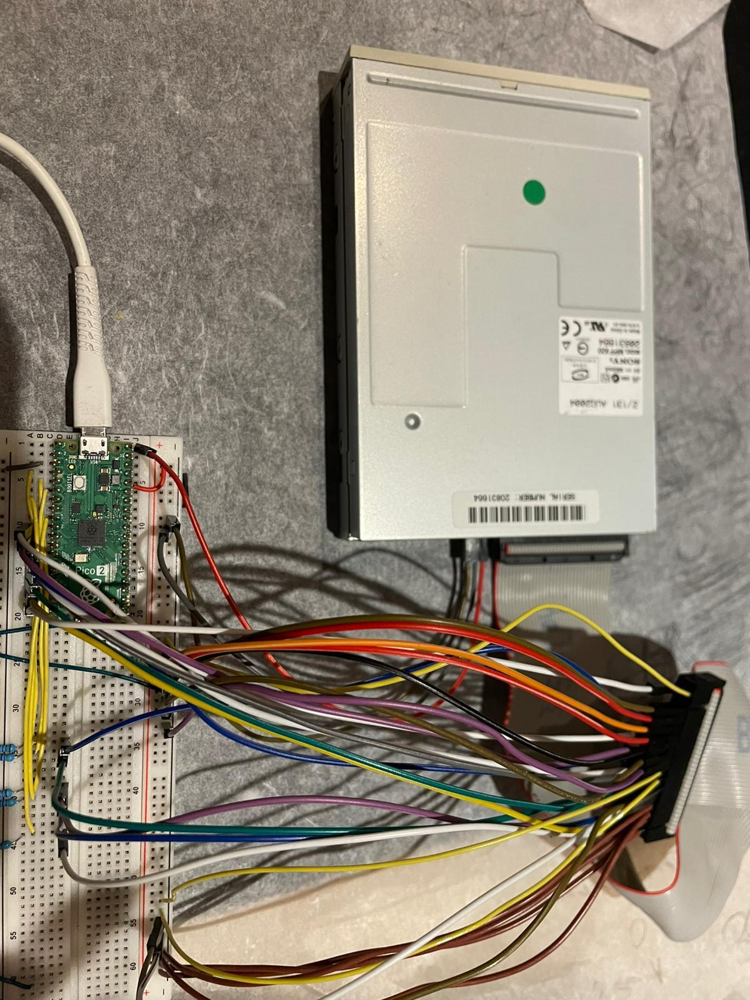

# Pico MFM Floppy

A bare-metal 1.44 MB 3.5-inch floppy driver and FAT12 filesystem for Raspberry Pi Pico and Pico 2. It uses PIO, DMA, and software MFM encoding instead of a floppy controller.



## Start here

The Pico is a 3.3 V device and is not 5 V tolerant. Read [Hardware](#hardware) before connecting a drive. Power the drive from a separate regulated 5 V supply, join the Pico and drive grounds, and pull `/READ_DATA` up to 3.3 V rather than 5 V.

1. Wire the drive using the pin table below.
2. Build the UF2 for the exact board using [Build firmware](#build-firmware).
3. Hold BOOTSEL while connecting the Pico, then copy `floppy_cli.uf2` to the mounted `RPI-RP2` volume.
4. Open the Pico USB CDC serial port with a terminal that sends CR or LF. UART output is disabled and the USB port does not depend on a baud rate.
5. Insert a disk and run `status`, then `mount`, then `ls`.

The boot banner names the cause of the last reset. If the previous run ended in a hard fault, the banner also prints the faulting program counter and link register, which `arm-none-eabi-addr2line -e floppy_cli.elf` maps to source lines.

Mounting is read-only. Do not run `format`, `test-full`, `test-mfm`, `test-fsck`, or `crashtest` on media that must be preserved. Start with `diskdump quiet` when evaluating an unknown disk without modifying it.

## Architecture

```text
Application: USB serial CLI, or SPI RPC slave
    |
    v
f12: mount state, checked handles, transaction exclusion
    |
    v
fat12: names, directories, cluster chains, copy-on-write commit, fsck
    |
    v
cache: write-back track cache, media generation, flush ordering
    |
    v
disk_device_t: read track, write track, media generation, write protect
    |
    v
floppy: drive control, recovery, verified track writes
    |
    v
mfm: adaptive decoding, streaming encoding, one timebase
    |
    v
flux_read.pio / flux_write.pio, DMA ring
```

The disk geometry is fixed and explicit: 80 cylinders, two heads, 18 sectors per track, and 512 bytes per sector. Sector identifiers used by the internal API are zero-based.

The library is split into:

- `disk.h`: geometry, the track type, the device interface, and the single error enum every layer returns.
- `mfm.c`: the MFM timebase and format constants, the streaming encoder with inner-track precompensation, and the adaptive decoder.
- `flux_read.pio` and `flux_write.pio`: timed flux capture and generation programs compiled by `pioasm`; their clocks come from the codec header.
- `floppy.c`: resource ownership, motor and head control, media detection, flux DMA, recovery, and verified track writes.
- `cache.c`: the only place a track lives in RAM. Sector reads and writes go through it, dirty sectors flush in ascending track order, eviction prefers clean slots, and a media change empties it.
- `fat12.c`: boot-sector validation, mounting, and formatting.
- `fat12_storage.c`: FAT entry encoding, cluster allocation, names, and directory storage.
- `fat12_file.c`: file reads, seeks, copy-on-write transactions, deletion, and renaming.
- `fat12_check.c`: directory-tree checking, FAT-copy selection, and staged repair. Shared FAT12 implementation details live in `src/internal/`.
- `f12.c`: mounted-filesystem state, opaque checked handles, and mutual exclusion between operations.
- `examples/cli.c`: USB serial administration, diagnostics, destructive tests, and power-cut verification.
- `examples/mfm_probe.c`: complete-revolution signal measurements and deterministic physical-test patterns, exercised by the host drive simulator.
- `examples/rpc.c`, `rpc_client.c`, and `rpc_server.c`: explicit wire encoding, checked file calls, and filesystem request handling, independent of SPI.
- `examples/rpc_slave.c` and `examples/rpc_master.c`: a two-Pico SPI transport and its serial console. The status byte on the wire is the library error enum.

The `floppy_core` target defines the portable library once for both firmware and host tests. `floppy_lib` adds the hardware driver and generated PIO headers; `floppy_rpc` adds the portable RPC implementation. Project C sources compile as C11; SDK sources retain the GNU extensions they require.

## Reliability model

Every function in the stack returns `disk_err_t`. A layer adds failure modes, it never re-encodes lower ones, so a CRC failure deep in the driver arrives at the shell as a CRC failure. File reads and writes return both the error and the number of bytes transferred. Partial progress is never disguised as complete success.

The drive serializes operations and gives control, read, write, raw-flux, and teardown paths bounded deadlines. A media generation is captured before I/O and checked throughout the operation, so removal or replacement invalidates cached data and open filesystem state. A disk-change signal already asserted when the drive is first selected after initialization is taken as the initial media state and cleared with the usual step; only an assertion observed after that counts as a change. Control operations such as homing observe the media after selecting the drive and proceed with whatever disk is present, and mounting or formatting adopts a change discovered before any data has been used; only a change discovered after that fails the operation, so cached and open state is invalidated exactly once. Media detection depends on the drive having a disk-change output on pin 34 that a step clears; a drive without one cannot report a swap. Reads reject conflicting copies of a sector and recovery is limited to explicit recalibration and head-jog attempts. The driver has no interrupt context and no locks; the application calls `floppy_poll` from its idle loop and the driver stops the motor after twenty idle seconds.

Writes stream MFM transitions through DMA, then read the track back and compare it with the requested image. Write protection, media changes, FIFO underruns, overruns, timeouts, CRC failures, wrong-track data, and verification failures remain distinct.

The cache is write-back. A file write dirties data tracks and FAT sectors in RAM; data tracks reach the disk when the cache needs their slot, the FAT reaches the disk at commit. Commit order is explicit in the FAT layer: data and FAT are flushed, the directory entry is written and flushed, and only then is the replaced chain freed and flushed. A power cut before commit leaves the FAT untouched. Aborting a write discards the dirty sectors. A failed commit keeps ownership and dirty sectors so `f12_close` can be retried. `f12_abort` is allowed while collecting data; once commit advances to flushing the new chain, abort returns `DISK_ERR_BUSY` and close must be retried.

Every file or directory open receives a nonzero 64-bit lifetime ID from one shared monotonic source. A handle contains only its filesystem pointer and ID; lookup checks the appropriate owner table. IDs are not reused during a program execution, including across `f12_init`, so closing, replacing media, or resetting a context cannot revive a stale handle. ID exhaustion rejects further opens instead of wrapping. Directory iterators exclude writers in either opening order, and an iterator stays at end-of-stream once it reaches the root terminator.

`floppy_t` and `f12_t` are large, aligned owner contexts intended for static storage. `floppy_init` accepts fresh storage, permits one active hardware context, rejects live reinitialization, and requires `floppy_deinit` before that storage is released or reused. `f12_init` is an explicit reset. `f12_is_mounted` is a typed query so an observer failure cannot be mistaken for an unmounted filesystem. All calls require application-level serialization.

Mount is read-only. `f12_fsck` with repair enabled performs the repair, clears the clean cache, and reads metadata from the device again. It returns success only if that scan is clean; its output report retains the defects and repairs from the original pass. FAT-copy ambiguity is reported rather than guessed.

## SPI RPC

The wire handle is the filesystem lifetime ID, encoded as eight little-endian bytes. The server holds no second handle table. Requests must have exact lengths, valid mode flags, and terminated strings without trailing bytes. File transfers carry both error status and partial progress; a read at EOF returns `DISK_END`.

The master retains its pending file when close fails. `close` retries the close, including a write commit; `abort` discards a write that has not entered commit. A write error triggers abort, and the console reports a successful write only after close succeeds. Repair uses the same verified `f12_fsck` contract as the local CLI. Both boards must run the current protocol.

## Hardware

The default CLI pin assignment is:

| Floppy pin | Signal | Pico GPIO | Direction |
|---:|---|---:|---|
| 2 | /DENSITY | GP15 | Pico to drive |
| 8 | /INDEX | GP14 | Drive to Pico |
| 12 | /DRIVE_SELECT_B | GP12 | Pico to drive |
| 16 | /MOTOR_ENABLE_B | GP10 | Pico to drive |
| 18 | /DIRECTION | GP9 | Pico to drive |
| 20 | /STEP | GP8 | Pico to drive |
| 22 | /WRITE_DATA | GP7 | Pico to drive |
| 24 | /WRITE_GATE | GP6 | Pico to drive |
| 26 | /TRACK_0 | GP5 | Drive to Pico |
| 28 | /WRITE_PROTECT | GP4 | Drive to Pico |
| 30 | /READ_DATA | GP3 | Drive to Pico |
| 32 | /SIDE_SELECT | GP2 | Pico to drive |
| 34 | /DISK_CHANGE | GP1 | Drive to Pico |

Connect every odd-numbered floppy pin to ground. Power the drive from a separate regulated 5 V supply sized for its spin-up current, and connect the drive and Pico grounds.

The firmware drives control signals as open-drain outputs. Do not expose a Pico GPIO to 5 V. `/READ_DATA` needs an external pull-up to 3.3 V; 4.7 kΩ is the tested value. Check the electrical requirements of the exact drive before connecting it.

Both pin tables live in `examples/board.h`. The alternate table, selected with `-DFLOPPY_ALT_PINS=ON`, keeps GP0 through GP4 free for the SPI slave link used by `floppy_rpc_slave`.

## Timing

Every MFM timing constant derives from one tick: 24 MHz, 48 ticks per 2 µs bit cell. The write PIO runs at that tick. The read PIO runs at three times the tick with a three-cycle counting loop, so both directions measure in the same unit. `floppy_init` rejects system clocks that are not an exact multiple of the read PIO clock.

The codec emits physical tick intervals. Only the floppy driver subtracts the write PIO instruction overhead when filling DMA buffers; flux capture utilities use the physical intervals directly.

The MFM decoder keeps one fractional cell-period estimate and derives its classification thresholds from it. It learns the initial period from a contiguous zero preamble and tracks bounded changes using short, medium, and long intervals. An invalid pulse breaks preamble continuity. The read PIO keeps every counter path at three state-machine cycles per tick, following the [RP2040 instruction timing rules](https://datasheets.raspberrypi.com/rp2040/rp2040-datasheet.pdf).

Write precompensation shifts individual transitions and balances neighboring intervals, preserving total track time. From cylinder 40 it applies a fixed three-tick (125 ns) shift using the MFM short-neighbor patterns also used by [Greaseweazle](https://github.com/keirf/greaseweazle/blob/master/src/greaseweazle/track.py). The amount requires drive and media calibration.

| Board | System clock | Read PIO | Read divider | Write PIO | Write divider |
|---|---:|---:|---:|---:|---:|
| Pico / RP2040 | 144 MHz | 72 MHz | 2 | 24 MHz | 6 |
| Pico 2 / RP2350 | 144 MHz | 72 MHz | 2 | 24 MHz | 6 |

72 MHz is the only in-spec RP2040 multiple, and it is too slow to drain the flux DMA ring in real time, so the examples run the RP2040 at 144 MHz, above its 133 MHz datasheet rating, with the core voltage raised to 1.20 V. The examples link with `copy_to_ram`, so the whole program runs from SRAM rather than executing in place from QSPI flash.

Measured on a Pico 1 with a Samsung SFD-321B drive before the cache rework, for reference:

| Metric | Value |
|---|---:|
| File write | 4,961 B/s |
| File read | 40,155 B/s |
| Full track scan | 32 s |
| Flux ring peak | 15 of 1024 words |

## Hardware validation

Use a disposable, writable 1.44 MB disk for the destructive hardware suite:

```text
version
rpm
test-full 12
mfmscan
```

Confirm firmware version `0.4.0`. Save the complete serial output, including the spindle periods, pattern rows, drive statistics, and final summaries.

`test-full` first writes seven patterns (`00`, `FF`, `55`, `AA`, `92`, `49`, and deterministic random data) to cylinders 0, 39, 40, and 79 on both heads. Each of these 56 cases uses the driver's verified write, seeks away, switches the motor off for one second, then captures three complete revolutions after restart. Every revolution must contain all 18 correctly addressed sectors with exact data, no duplicates, and no CRC or format errors. Each case reports retries, overruns, underruns, and peak DMA ring usage; retries and flow faults fail this strict pattern check. Cylinders 39 and 40 straddle the precompensation boundary.

The suite then formats every track, exercises raw-flux ownership, rejects concurrent motion and teardown, verifies stable media generation, performs filesystem operations with varied transfer sizes, fills every free cluster with deterministic randomized files, verifies exact disk-full transactions, deletes files across the disk, refills the fragmented space to capacity, observes verified DMA track writes, remounts, requires a clean filesystem check, and reads all 160 tracks. A successful run ends with `ALL PASSED` and leaves the drive unmounted, deselected, and stopped. The `rounds` argument controls filesystem stress; the pattern matrix runs once per `test-full` invocation.

`mfmscan` is read-only and checks three complete revolutions on every track of both heads. Look for `160 clean tracks, 0 failed, 0 untested`. It reports capture errors explicitly and stops on an I/O error; finding all sectors across several incomplete revolutions does not count as a clean track. `mfm 40 1` provides a pulse histogram and fractional cell-period estimate for a specific cylinder and head.

To repeat just the MFM pattern matrix, run `test-mfm 3` for three rounds. This destroys the filesystem on the test disk and leaves raw patterns behind; run `test-full` or `format` afterwards before using filesystem commands. Random data changes between rounds to expose stale read-back. The default is one round.

These checks measure the configured precompensation on this drive and disk. A clean result does not establish its optimal amount. Reading a disk written by another controller, and reading a Pico-written disk on that controller, also checks interoperability beyond a same-drive round trip.

Test the physical disk-change path with a mounted canonical FAT12 disk and a second canonical FAT12 disk ready:

```text
test-media
```

At the first prompt, eject the mounted disk, leave the drive empty, and enter `y`. After the stale-state checks pass, insert the replacement disk and confirm the second prompt.

Use `crashtest`, cut power during its overwrite loop, reboot, and run `crashcheck` for physical power-loss validation. The check accepts only the recorded old or new target generation and requires the stable and filler files to remain exact.

Exercise repair on real media with a disposable disk:

```text
test-fsck
```

This formats the disk, writes four files, rewrites the FAT track so that one chain crosslinks into another, one loops onto itself, one ends early and one allocated cluster is unreachable, then requires the check report to match the host suite exactly, repairs, requires convergence, and verifies every surviving byte. A second phase damages only the second FAT copy and requires the first copy to be chosen and the second rewritten. The scenario and its expected report live in `examples/fsck_scenario.h`, which the host suite asserts against the same values. To check directory traversal on real media, mount a disk formatted elsewhere that contains subdirectories and run `fsck`; it must report clean with the correct directory count.

## Build firmware

Install the Pico SDK and export `PICO_SDK_PATH`.

```sh
cmake -S . -B build-rp2040 -DPICO_BOARD=pico -DCMAKE_BUILD_TYPE=Release
cmake --build build-rp2040 --parallel
```

```sh
cmake -S . -B build-rp2350 -DPICO_BOARD=pico2 -DCMAKE_BUILD_TYPE=Release
cmake --build build-rp2350 --parallel
```

Each build produces `floppy_cli.uf2`, `floppy_rpc_slave.uf2`, and `floppy_rpc_master.uf2`. Project sources compile with warnings treated as errors, including pedantic, conversion, sign-conversion, shadow, format, undefined-macro, and strict-prototype diagnostics.

## Run host tests

The host test programs require a C23 compiler, CMake, and `pioasm` on `PATH` or in the Pico SDK build locations searched by CMake.

```sh
./tests/run_all.sh
```

It exercises geometry, the track cache, the MFM codec, FAT12 and f12 contracts, RPC parsing and partial I/O, malformed media, fuzz cases, PIO simulation, PIO instruction emulation, timeout and underrun paths, and write verification. When the SCP fixture at `system-shock-multilingual-floppy-ibm-pc/disk1.scp` is present, or another capture is named through `SCP_FIXTURE`, the suite also decodes the real capture, round-trips it through the encoder, and runs end-to-end corruption recovery against it.

Run the same suite with sanitizers:

```sh
./tests/run_all.sh -DENABLE_SANITIZERS=ON
```

Increase deterministic SCP round-trip coverage:

```sh
./tests/run_all.sh -DSCP_ITERATIONS=100
```

Generate coverage reports with `gcovr`:

```sh
./tests/run_coverage.sh
```

## Simulation model

The host suite tests these boundaries:

- `flux_sim` decodes synthetic tracks and the SCP capture as transition intervals.
- `pio_emu` executes the generated PIO instructions, checks timing across pulse widths, phases, and counter wrap, and connects the write and read programs to round-trip an entire precompensated track through the decoder.
- `pio_sim` models GPIO, index pulses, head motion, DMA rings, FIFOs, write gating, media changes, write protection, torn writes, stalls, and read-back verification while running the production floppy driver.
- `test_mfm_probe` runs the physical pattern matrix through that driver and checks that wrong addresses, duplicate sectors, valid-CRC data mismatches, incomplete individual revolutions, stuck index, media changes, and overruns cannot produce a successful measurement.
- `vdisk` is the block device double for the cache, FAT12, f12, and RPC suites, with knobs for typed read and write failures, torn writes, generation changes, and per-track faults.

Synthetic flux tests run even without an SCP fixture. Encoder tests independently derive MFM clock bits for every two-byte combination and check the missing-clock A1 sync words. Precompensation tests compare absolute transition positions against a bit-pattern oracle and require zero accumulated timing drift.

Flux and PIO simulation use the same seeded timing-noise model. It can combine independent transition jitter, fixed spindle-rate error, bounded correlated speed wander, and sparse impulse displacement. Noise is disabled unless a test configures it, so unrelated tests remain deterministic.

The simulator does not claim to model analog voltage thresholds, cable reflections, grounding faults, motor torque, head alignment, magnetic media physics, or real interrupt timing. Use `test-full`, `test-media`, and the power-cut procedure for those hardware boundaries.

## CLI

The firmware exposes a USB serial CLI. `help` prints the exact command grammar. Filenames are canonical FAT12 8.3 names; invalid or overlong input is rejected instead of truncated.

`write` and `cp` retain a writer whose final commit failed. Run `commit` to resume that commit. Unmount, format, destructive tests, and reboot refuse to silently discard it.

`fsck` reports every detected defect. `fsck fix` repairs and immediately checks convergence. `dump` and `diskdump` read whole tracks. `crashtest` repeatedly replaces a target file for physical power-cut testing; after reboot, `crashcheck` requires the stable and filler files to be exact and the target to be exactly either the recorded old value or the recorded new value.

`format`, `test-full`, `test-mfm`, `test-fsck`, and `crashtest` destroy data. Use media that can be erased.

## License

MIT
